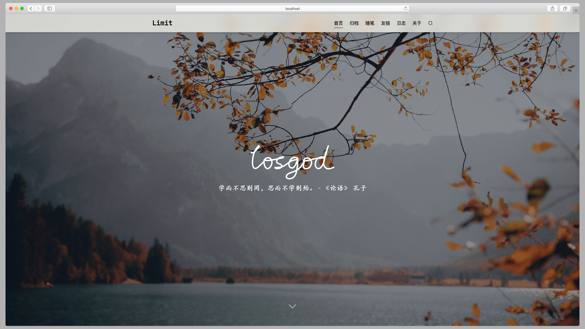

# Halo-Theme-Limit

主题基于 [Halo](https://halo.run) 博客系统，主题样式参考了多种主题，包含 [Halo-Theme-Xue](https://github.com/xzzai/halo-theme-xue) 、 [Typecho-Mirages](https://get233.com/archives/mirages-intro.html) 。

该主题通过 `marked` 实现了首页自定义信息，类似 GitHub 的用户 Profile Readme 效果。可以在主题设置位置，传入自己的 Markdown 文件，亦或是将 GitHub Profile Readme 文件地址直接写入。

## 预览

[预览地址](https://losgod.xin)

## 实现的页面

此主题实现了绝大部分页面，仅标签 tags 、分类 categories 页面没有实现。已实现的页面中**日志页**与**友链**页没有找到钟意的样式，就随便写了下。

## 注意

当前版本基于 Halo 1.3.2 ，适用于此版本，后续是否更新暂定。如有需要请自行 Fork 更改。有看不懂的地方可提交 Issues 或是发送邮件到 [wangcnkym@gmail.com](mailto:wangcnkym@gmail.com) 
